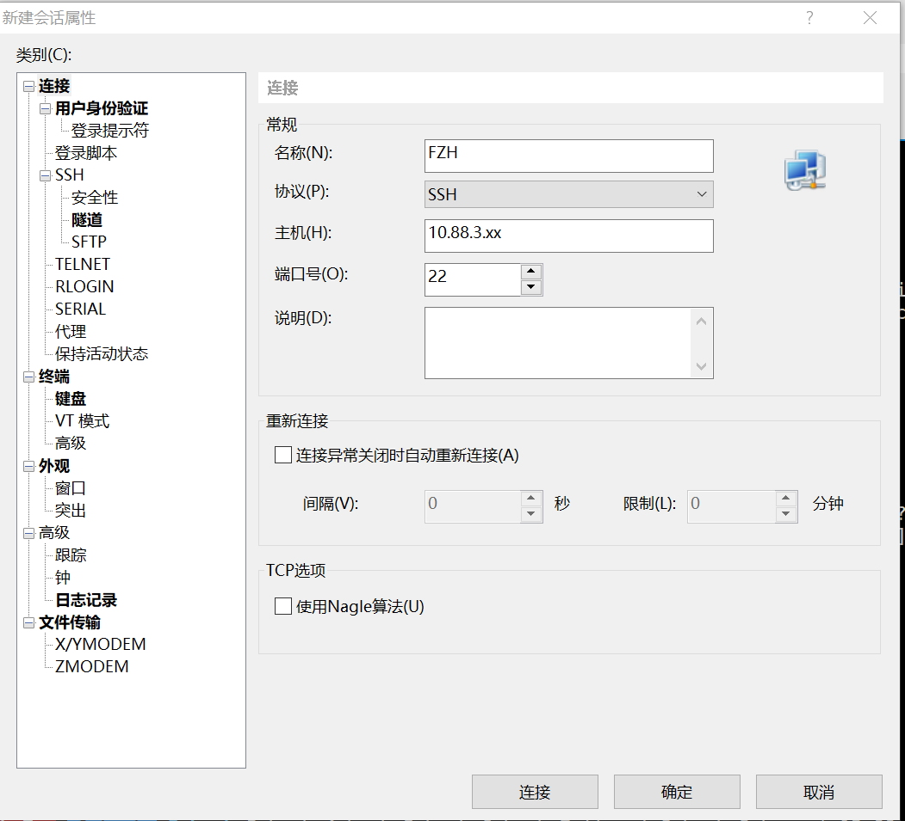
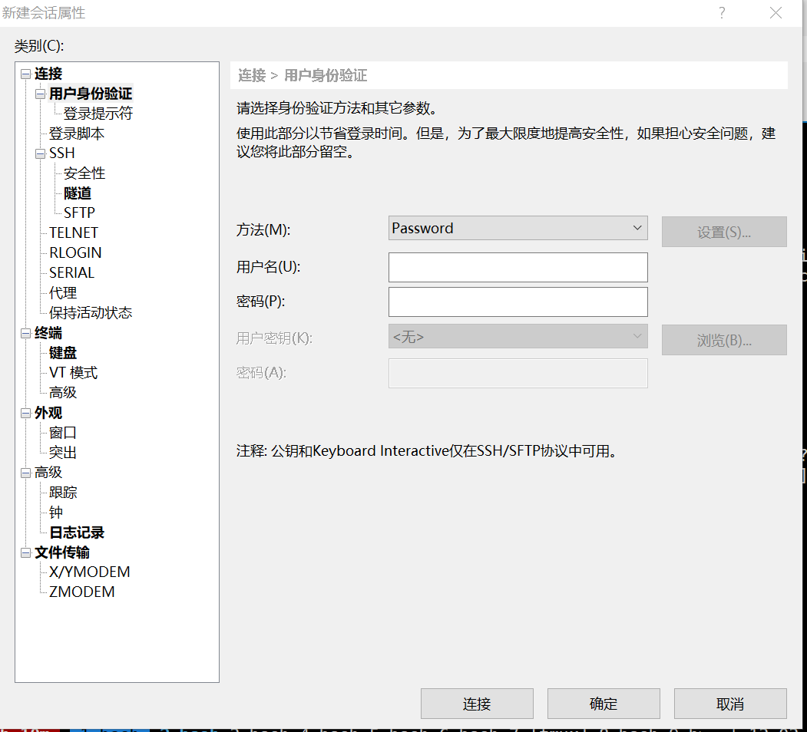

# Server-Settings For Windows
## 1.命令行代码
下载免费版XShell: https://www.netsarang.com/zh/free-for-home-school/

## 2.配置自己的服务器环境
下载最新版的Anaconda: https://mirrors.tuna.tsinghua.edu.cn/anaconda/archive/

## 3.

## 4.
